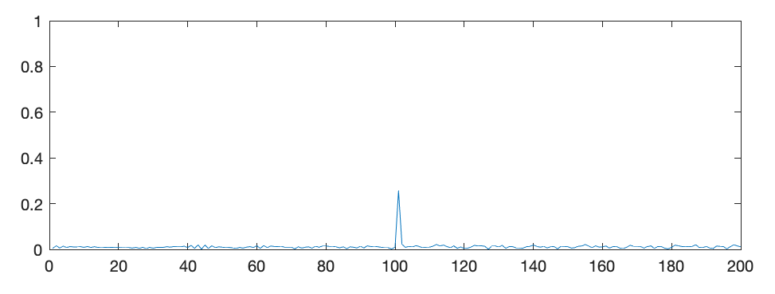
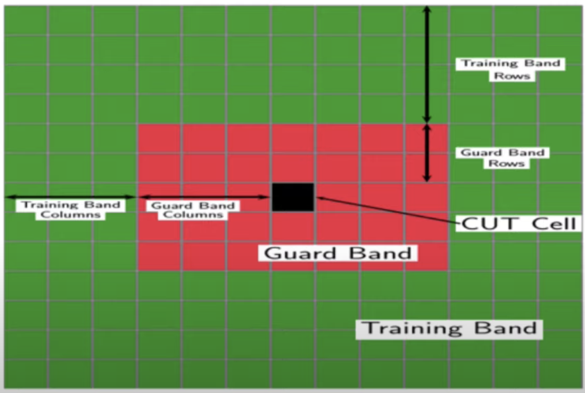
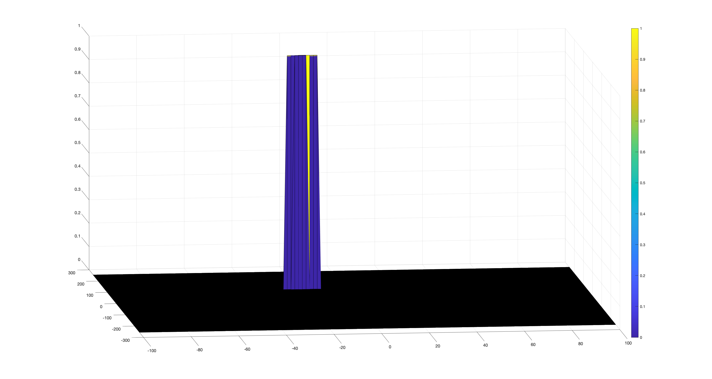

## Objective of Radar Target Generation and Detection

This project aims to generate and detect radar targets on the defined radar specification with the assumption of a constant speed model. Based on the specification of the radar, the key parameters such as bandwidth and chirp time could be calculated. In addition, the intermedate radar signals is the mixure of the signals from the transmitter and receiver, determined by the radar hardware mechanism. In order to identify the target, the mixure signal can be processed via 2D FFT to determine the range and the Doppler value. The range is the target range and Doppler is attributed to the speed. In order to reduce the false rate of target recognition, the 2D CFAR was implemented, which can significantly suppress the noise and improve the SNR. It can be formulated as follows (source: Udacity Sensor Fusion Letcture Note):


* Configure the FMCW waveform based on the system requirements.
* Define the range and velocity of target and simulate its displacement.
* For the same simulation loop process the transmit and receive signal to determine the beat signal
* Perform Range FFT on the received signal to determine the Range
* Towards the end, perform the CFAR processing on the output of 2nd FFT to display the target.


##  FMCW Waveform Design

Using the given system requirements, design a FMCW waveform. Find its Bandwidth (B), chirp time (Tchirp) and slope of the chirp.
The B and Tchirp can be directly calculated based on the Radar Spec and Formular B = c/2*(Range Resoluton),  Tchirp = 5.5 * 2 * (Max Range) / light speed .
```Matlab
% Spec Definaton
Rmax = 200 ; % max range
Dres = 1 ; % range resolution

% Sweep band width and Tchirp calculaiton
B  =  c / 2*Dres; % sweep bandwidth
Tchirp = 5.5 * 2 * Rmax /c ; 

```

## Simulation Loop

Simulate Target movement and calculate the beat or mixed signal for every timestamp.

* S1: Iterate all the time points
* S2: Update the range
* S3: Calculate the time delay and save intoo r_t vector
* S4: Simulate  the Tx and Rx signal
* S5: Calculate the mixture signal Mix(i) = Tx(i) * Rx(i)

Those steps can be illustrate into the following figure (Source: Udacity Sensor Fusion Letcture Note):


```Matlab
for i=1:length(t)         
    % *%TODO* :
    %For each time stamp update the Range of the Target for constant velocity. 
    r_t(i) = R + v*t(i); %% 
    % *%TODO* :
    %For each time sample we need update the transmitted and
    %received signal. 
    td(i) = 2*r_t(i) /c;
    Tx(i) = cos(2 * pi * ( fc*t(i) + slop*(t(i)^2) / 2 ));
    Rx(i)  = cos(2*pi*(fc*(t(i)-td(i)) + slop*(t(i)-td(i))^2 / 2 ));
    % *%TODO* :
    %Now by mixing the Transmit and Receive generate the beat signal
    %This is done by element wise matrix multiplication of Transmit and
    %Receiver Signal
    Mix(i) = Tx(i)*Rx(i);
end
```


## Range FFT (1st FFT)
Implement the Range FFT on the Beat or Mixed Signal and plot the result.
In the following plot we could see the target is detect around 100 meters.

**1D FFT in Range Direction**


## 2D CFAR

Implementation steps for the 2D CFAR process.

The defination of the Training Size and Guard Size use the defualt value. The implementation of the can be summaried into 5 steps:

* Step1: iterate all the CUT cells
* Step2: Accumulate the value of the training cells which related to the current CUT
* Step3: Calculate the threshold, which is the mean of the accumulation plus the offset
* Step4: Assign the current CUT as 1 if the vaule of CUT > threshold, otherwise asign to 0;
* Step5: loop Step1 if all the CUT cells  are not iterated.

``Matlab  
RDM_CFAR = zeros(size(RDM));   
for cx = Tr+Gr+1: Nr/2- (Tr+Gr)       
    for cy = Td+Gd+1:Nd-(Td+Gd)
        noise_level =  zeros(1,1);
        for p= cx-(Tr+Gr) : cx+Tr+Gr
            for q= cy-(Td+Gd) : cy+Td+Gd
               if(abs(cx-p)>Gr || abs(cy-q) >Gd)
                   noise_level = noise_level + db2pow(RDM(p,q));
               end
            end       
        end
        threshold = pow2db( noise_level / (2*(Td+Gd+1)*2*(Tr+Gr+1)-(Gr*Gd)-1));
        threshold = threshold + offset;
        CUT = RDM(cx,cy);
        if CUT < threshold 
            RDM_CFAR(cx,cy) = 0;
        else 
            RDM_CFAR(cx,cy) = 1;        
        end       
    end   
end
```


Selection of Training, Guard cells and offset.
The Training and Guard value has used the default value from the course, offset  has been change from 6 to 9 which can better  suppress the noise value.

**1D FFT in Range Direction (Source: Udacity Sensor Fusion Letcture Note)**

```Matlab
Tr = 10 ; 
Td = 8 ;
Gr = 4;
Gd  = 4;
```

Steps taken to suppress the non-thresholded cells at the edges.

There are two approches to  set the  cells at edges to zero:

* Approch 1: copy the RDM to  a new  matrix RDM_CFAR, set the matrix  as zero before the 2D CFAR. In the 2D  CFAR if RDM(cx,cy) > threshold,  asign RDF_CFAR(cx,cy) as 1, otherwise asign as 0;
```Matlab
RDM_CFAR = zeros(size(RDM));   
```

* Approch2: RDM after 2D CFAR, select each cells which have not  been processed durng 2D CFAR process and set all  those cells 0
```Matlab
RDM(:, 1 : Td + Gd) = 0;
RDM(:, Nd - (Gd + Td) + 1 : end) = 0;       
RDM(1 : Tr + Gr, :) = 0;
RDM(Nr/2 - (Gr + Tr) + 1 : end, :) = 0;
```
**Visualization of the signal after 2D CFARs**

